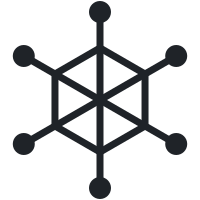

<p align="center">
  <picture>
    <source media="(prefers-color-scheme: dark)" srcset="assets/logo-dark.svg">
    
  </picture>
</p>

# Switchyard

> One repo, many AI coding agents, zero collisions — Switchyard's `fleet` CLI gives every agent an isolated git worktree, with collision detection before you merge.

[](https://www.npmjs.com/package/@switchyardhq/switchyard)
[](https://www.npmjs.com/package/@switchyardhq/switchyard)
[](LICENSE)
[](https://github.com/MohammedAlkindi/Switchyard/actions/workflows/ci.yml)

[](tsconfig.json)
[](https://github.com/MohammedAlkindi/Switchyard/pulls)

<!-- The coverage badge is a static number: re-run `npm run test:coverage` and update it
     when it drifts. Replace with a Codecov (or similar) badge once coverage upload is
     wired into CI.
     It understates real coverage. `src/cli.ts` and `src/commands/mcp.ts` both report 0%
     because their tests (lock-race.test.ts, mcp-server.test.ts) drive them as real
     subprocesses, which v8 instrumentation in the parent process cannot see. The
     protocol logic those two files delegate to — src/lib/jsonrpc.ts and src/lib/mcp.ts —
     is at 100%. -->


<p align="center">
  
</p>

<p align="center">
  <sub><code>fleet spawn</code> two agents · <code>fleet list</code> the whole fleet · <code>fleet check</code> catches the collision before anyone merges · <a href="assets/demo.mp4">full-quality mp4</a></sub>
</p>

<!-- The demo is rendered from demo.tape with vhs (see the comments at the top of that
     file), producing assets/demo.mp4. The inline GIF is converted from it with:
       ffmpeg -i assets/demo.mp4 -vf "fps=10,scale=960:-1:flags=lanczos,split[s0][s1];[s0]palettegen=max_colors=128[p];[s1][p]paletteuse=dither=bayer:bayer_scale=5" -loop 0 assets/demo.gif
     (GitHub only inline-plays mp4s uploaded via its web editor, not committed files —
     a committed GIF is the reliable way to get a moving demo on the README.) -->

Two AI coding agents on one checkout ends badly. This project exists because Codex silently ran a `git reset` on `main` mid-merge while Claude Code was mid-task on the same files — the merge state vanished and neither agent noticed. The failure mode isn't exotic: two agents, one working tree, no isolation. Switchyard (published as `@switchyardhq/switchyard`; the installed command is `fleet`) gives each agent its own git worktree and branch, tracks them centrally, and flags collisions between agents before anyone merges.

## What it looks like

*(The same flow as the [demo video](assets/demo.mp4), in skimmable, copy-pasteable form.)*

```console
$ fleet spawn claude
Spawned agent claude
  branch:   fleet/claude (from main)
  worktree: ~/project/.fleet/worktrees/claude

Point your agent at it:
  cd ~/project/.fleet/worktrees/claude

$ fleet list
┌────────┬──────────────┬──────┬───────┬───────────────┬───────────────┬──────────────────────────┐
│ AGENT  │ BRANCH       │ BASE │ +/-   │ CHANGES       │ LAST ACTIVITY │ WORKTREE                 │
├────────┼──────────────┼──────┼───────┼───────────────┼───────────────┼──────────────────────────┤
│ claude │ fleet/claude │ main │ +3/-0 │ clean         │ 12m ago       │ .fleet/worktrees/claude  │
│ codex  │ fleet/codex  │ main │ +1/-2 │ 4 uncommitted │ just now      │ .fleet/worktrees/codex   │
└────────┴──────────────┴──────┴───────┴───────────────┴───────────────┴──────────────────────────┘

$ fleet check
1 collision risk detected:
┌───────────────────┬───────────────┬───────────────┐
│ FILE              │ AGENTS        │ VERDICT       │
├───────────────────┼───────────────┼───────────────┤
│ src/api/routes.ts │ claude, codex │ will conflict │
└───────────────────┴───────────────┴───────────────┘
Verdicts from git merge-tree simulation of each agent pair's committed work; uncommitted edits can't be simulated and stay blocking.
```

## Installation

```sh
npm install -g @switchyardhq/switchyard
```

Requires Node.js >= 18.17 and git >= 2.31. The installed command is `fleet`.

## Quickstart

```sh
cd your-repo
fleet init                      # config, ignore entry, and the agent-facing docs
fleet spawn claude              # isolated worktree on branch fleet/claude
cd .fleet/worktrees/claude      # point your agent here and let it work
fleet check                     # any files also touched by other agents?
fleet sync claude               # base moved on? catch the branch up
fleet exec claude -- npm test   # run commands in the worktree without cd'ing
fleet diff claude               # review the branch before merging
fleet merge claude              # merge into your current branch + clean up the agent
fleet undo                      # …and roll that merge back if it was a mistake
fleet pr claude                 # …or push it and open a PR via gh instead
```

## Commands

| Command | Description | Key flags |
| --- | --- | --- |
| `fleet init` | Set the repo up for the fleet workflow: starter `.fleetrc.json`, `.fleet/` in `.git/info/exclude`, the Claude Code skill in `.claude/skills/`, and a protocol block in `AGENTS.md`. Idempotent — re-run after upgrading to refresh the agent-facing docs | `--force` overwrite an existing `.fleetrc.json`, `--json` machine-readable output |
| `fleet spawn <agent>` | Create a worktree in `.fleet/worktrees/<agent>/` on a new branch `fleet/<agent>`, then provision it (`copyOnSpawn` / `postSpawn` below) | `--from <branch>` base branch (default: current branch) |
| `fleet list` | All active agents: branch, base, ahead/behind, uncommitted count, last activity | `--json` machine-readable output |
| `fleet status <agent>` | One agent in detail: uncommitted files, diff stat vs base, ahead/behind | `--json` machine-readable output |
| `fleet check` | Table of files touched by more than one agent. On git ≥ 2.38 each shared file gets a merge-simulation verdict — files whose committed changes merge cleanly are reported but don't block or fail the check. Exits 1 on real collision risks (CI-friendly) | `--lines` only count overlapping line ranges, `--files-only` skip simulation; flag any shared file, `--json` machine-readable output |
| `fleet diff <agent>` | Full diff of the agent's branch against its base | `--base <branch>` diff against a different branch |
| `fleet sync <agent>` | Merge the agent's base branch into its branch, catching it up. A conflicting merge is aborted — never left half-done | — |
| `fleet exec <agent> -- <cmd>` | Run a shell command inside the agent's worktree (e.g. `fleet exec claude -- npm test`) | `--all` run in every worktree sequentially; exits 1 if any run fails |
| `fleet merge <agent>` | Check for collisions, run the `preMerge` hook, merge the agent's branch into the current branch, then remove the worktree and branch. A conflicting merge is aborted — never left half-done. Overlaps that provably merge cleanly no longer block; predicted conflicts and uncommitted overlaps still do | `--no-clean` keep the worktree and branch, `--delete-branch` explicit form of the default cleanup |
| `fleet undo` | Roll back the last `fleet merge`: reset the target branch, restore the agent's branch, worktree, and state entry. Single-level; refuses if history moved on | — |
| `fleet pr <agent>` | Push the agent's branch to `origin` and open a pull request with the [GitHub CLI](https://cli.github.com) — the review-based alternative to a local merge | `--title <t>`, `--base <branch>`, `--draft` |
| `fleet remove <agent>` | Remove the worktree; refuses if there are uncommitted changes | `--force` discard changes, `--delete-branch` also delete the branch |
| `fleet clean` | Remove agents whose branches are fully merged into their base | `--dry-run` list only, `--stale <days>` also remove long-idle agents (clean worktrees only; their branches are kept) |
| `fleet watch` | `fleet list`, re-rendered live until Ctrl+C | `--interval <seconds>` refresh rate (default 3) |
| `fleet doctor` | Diagnose git version, state file validity, orphaned worktrees, and stale entries. Exits 1 if problems remain | `--fix` repair: rebuild state from `git worktree list`, adopt/remove orphans, prune stale entries; `--json` machine-readable output |
| `fleet completion <shell>` | Print a completion script for `bash`, `zsh`, or `fish` (agent names are a snapshot from generation time) | — |
| `fleet mcp` | Serve the read-only fleet tools to an AI agent over MCP (stdio). Not run by hand — see [Use it from an AI agent](#use-it-from-an-ai-agent-mcp) | — |

All commands work from the main checkout **or** from inside any agent worktree.

### Scripting and CI

`list`, `status`, `check`, and `doctor` all take `--json` for machine-readable output, so agents and CI can consume Switchyard state directly — e.g. a merge gate:

```sh
fleet check --json || exit 1                  # exit code alone is enough for CI
fleet list --json | jq -r '.[].name'          # enumerate active agents
```

`fleet check --lines` refines collision detection from files to line ranges: two agents editing disjoint parts of one file are reported separately instead of blocking. Ranges are computed against each pair's merge base — exact when both agents share a base, a documented heuristic otherwise (see [docs/architecture.md](docs/architecture.md)).

On git ≥ 2.38, `fleet check` upgrades from "same file" to "would actually
conflict": each pair of overlapping agents is merged in memory with
`git merge-tree`, and cleanly merging overlaps are demoted to an informational
list (they no longer exit 1). `--files-only` restores plain file-level
behavior; older git falls back to it automatically. JSON output carries
`prediction: "merge-tree" | "files"` so scripts know which semantics ran.

## Use it from an AI agent (MCP)

Everything above assumes a human at a terminal. `fleet mcp` gives the agents
themselves a way to see the fleet: it serves Switchyard state over the
[Model Context Protocol](https://modelcontextprotocol.io) on stdio, so an agent
can check for collisions **before** it starts editing rather than discovering
them at merge time.

Point an MCP client at it:

```json
{
  "mcpServers": {
    "switchyard": {
      "command": "fleet",
      "args": ["mcp"]
    }
  }
}
```

Without a global install, use `"command": "npx", "args": ["-y", "@switchyardhq/switchyard", "mcp"]`.

### The tools

| Tool | Arguments | Returns |
| --- | --- | --- |
| `fleet_list` | — | Every active agent: branch, base, worktree path, ahead/behind, uncommitted count, last activity |
| `fleet_status` | `agent` | One agent in detail: record, ahead/behind, uncommitted files, diffstat vs base |
| `fleet_check` | `lines?`, `filesOnly?` | Files touched by more than one agent, with merge-simulation verdicts |
| `fleet_lock_status` | — | Whether a `fleet` command is currently mutating the repo |

Each returns the same object the matching `--json` flag prints, so the CLI and
the MCP surface can never disagree about what the state is.

### What the agent actually sees

The demo GIF above shows the human side. This is the same collision from the
agent's side — a real session against `fleet mcp`, two agents having both
rewritten `src/api/routes.ts`:

```jsonc
// → the client opens the session
{"jsonrpc":"2.0","id":1,"method":"initialize",
 "params":{"protocolVersion":"2025-11-25","capabilities":{},
           "clientInfo":{"name":"demo-client","version":"1.0.0"}}}

// ← the server answers, and states the read-only contract up front
{"jsonrpc":"2.0","id":1,"result":{
  "protocolVersion":"2025-11-25",
  "capabilities":{"tools":{}},
  "serverInfo":{"name":"switchyard","title":"Switchyard","version":"0.3.0"},
  "instructions":"... These tools are read-only by design. Spawning agents,
                  merging, and removing worktrees are human actions in this
                  release — there are no tools for them. Ask for
                  `fleet spawn <name>` rather than creating a worktree yourself."}}

// → before editing anything, the agent checks
{"jsonrpc":"2.0","id":2,"method":"tools/call",
 "params":{"name":"fleet_check","arguments":{}}}
```

The reply's content block carries the same object `fleet check --json` prints:

```json
{
  "collisions": [
    { "file": "src/api/routes.ts", "agents": ["claude", "codex"], "verdict": "conflicts" }
  ],
  "prediction": "merge-tree",
  "agentsChecked": 2,
  "cleanMerges": []
}
```

`"verdict": "conflicts"` is the agent's cue to stop and coordinate — reached
before it wrote a line, rather than at merge time.

### These tools are read-only, deliberately

There is no `fleet_spawn`, `fleet_merge`, or `fleet_remove`. Agents can observe
the fleet; they cannot join or change it. Provisioning and merging stay human
actions in this release.

That is a real limitation, not a technicality, and it has a failure mode worth
naming: an agent that goes looking for a spawn tool, finds none, and falls back
to a raw `git worktree add` has produced exactly the untracked, uncoordinated
state Switchyard exists to prevent. The server therefore says so at handshake
time, and the shipped skill says so again — an agent should *ask* for
`fleet spawn <name>` instead.

A pleasant consequence: since `spawn` is not exposed, the `postSpawn` hook
(arbitrary shell from `.fleetrc.json`) is not reachable from an agent at all.

### Teaching agents the convention

The tools report state; they cannot convey that you are expected to check
*before* editing rather than before merging, or that provisioning is something
to ask a human for. That convention is the actual product, and `fleet init`
installs it in two forms:

| Artifact | Audience |
| --- | --- |
| `.claude/skills/switchyard/SKILL.md` | Claude Code, which loads the full skill on demand |
| A marked block in `AGENTS.md` | Any agent that reads `AGENTS.md` up front — Codex, Cursor, and others |

Two texts rather than one generated from the other, because the audiences
differ: a skill loaded on demand can afford a hundred lines, an always-read
file cannot.

Both are package-managed and refreshed on every `fleet init`, so upgrading the
package and re-running is enough to keep them current. In `AGENTS.md` only the
region between `<!-- switchyard:begin -->` and `<!-- switchyard:end -->` is
rewritten — the rest of the file is yours and is never touched. `.fleetrc.json`
is treated the opposite way: it is your file, so init never overwrites it
without `--force`.

If the markers are ever half-deleted or inverted, init refuses rather than
guessing where your content ends.

## Configuration

An optional `.fleetrc.json` at the repo root sets per-repo defaults. Precedence everywhere: CLI flag > `.fleetrc.json` > built-in default.

```json
{
  "$schema": "https://unpkg.com/@switchyardhq/switchyard/schema/fleetrc.schema.json",
  "defaultBase": "main",
  "watchInterval": 3,
  "autoClean": false,
  "copyOnSpawn": [".env"],
  "postSpawn": "npm ci",
  "preMerge": "npm test"
}
```

- `$schema` — optional; points editors at the config's JSON schema for autocomplete and validation. The schema ships with the package (`node_modules/@switchyardhq/switchyard/schema/fleetrc.schema.json`).
- `defaultBase` — base branch for `fleet spawn` when `--from` is not passed (built-in default: the current branch).
- `watchInterval` — refresh interval for `fleet watch`, in seconds (built-in default: 3).
- `autoClean` — when `true`, every successful `fleet merge` also runs a `fleet clean` sweep for other fully merged agents (built-in default: `false`).
- `copyOnSpawn` — repo-root-relative files/directories copied into every new worktree by `fleet spawn`. Worktrees don't carry gitignored files, so a fresh one has no `.env` or local config — this fixes that. Missing entries are skipped with a note.
- `postSpawn` — shell command run inside the new worktree after `fleet spawn` (e.g. `npm ci`), so the worktree is ready to work in. A failing hook is reported but the worktree is kept.
- `preMerge` — shell command run inside the agent's worktree before `fleet merge` starts (e.g. `npm test`). A non-zero exit aborts the merge before anything is touched.

A malformed config file is a hard error with the offending key named; a missing one is fine.

> [!NOTE]
> `postSpawn` and `preMerge` run shell commands straight from the repo's `.fleetrc.json` — the same trust you already extend to a repo's npm scripts or git hooks. Review that file before running `fleet spawn` or `fleet merge` in a repository you didn't author (details in [SECURITY.md](SECURITY.md)).

## How it works

`fleet spawn` runs `git worktree add` under the hood: each agent gets a real, separate directory with its own checkout of a dedicated `fleet/<agent>` branch, so one agent's `git reset` physically cannot touch another agent's files. A single gitignored `.fleet/state.json` in the main repo maps each agent to its branch, base, and worktree, and `fleet check` uses it to diff every agent branch against its base (`git diff base...branch`, plus uncommitted edits) and cross-reference the changed files. Switchyard also adds `.fleet/` to `.git/info/exclude` automatically, so it never dirties the repos it manages. Design rationale and limitations live in [docs/architecture.md](docs/architecture.md).

## Contributing

PRs are welcome. Clone, `npm install`, `npm test` — every command is tested against real throwaway git repositories, and any change to a command must come with such a test (no git mocks; see [CLAUDE.md](CLAUDE.md) and [AGENTS.md](AGENTS.md) for the ground rules). Commits follow [Conventional Commits](https://www.conventionalcommits.org/). Read [docs/architecture.md](docs/architecture.md) before structural changes, and [docs/deployment.md](docs/deployment.md) for the release process.

## License

MIT © Mohammed Alkindi — see [LICENSE](LICENSE).
