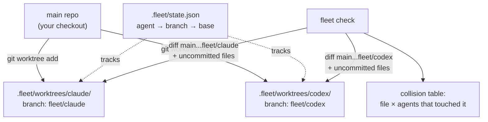

# Architecture

## The model: one worktree per agent

```
your-project/                        <- main repo, your own checkout (e.g. main)
├── .git/
│   └── info/exclude                 <- fleet adds ".fleet/" here on first spawn
├── .fleet/                          <- never committed, lives only on disk
│   ├── state.json                   <- coordination layer (source of truth)
│   └── worktrees/
│       ├── claude/                  <- full checkout of branch fleet/claude
│       └── codex/                   <- full checkout of branch fleet/codex
└── src/ ...                         <- your files, untouched by any agent
```



`fleet spawn <name>` runs `git worktree add .fleet/worktrees/<name> -b fleet/<name> <base>`, records the mapping in `state.json`, then provisions the worktree (`copyOnSpawn` files first, `postSpawn` hook second, so the hook can rely on the copied files). `fleet check` walks every recorded agent, collects the files each one changed (`git diff --name-only <base>...<branch>` for committed work, `git status --porcelain` in the worktree for uncommitted work), and reports any file that appears under more than one agent. `fleet merge` runs that same check first, refuses while the target agent collides with another active agent, runs the `preMerge` hook, merges into the main worktree's current branch, and aborts cleanly (`git merge --abort`) on conflict — the repo is never left mid-merge. `fleet sync` is the same abort-on-conflict merge in the other direction: base into agent branch, run inside the agent's worktree.

`fleet exec <agent> -- <cmd>` re-joins the argv into one shell command (`src/lib/proc.ts` `shellJoin`, a pragmatic quoting heuristic for sh and cmd.exe) and runs it with the worktree as cwd; `--all` fans out sequentially so output never interleaves. `fleet pr` never bundles GitHub logic: it verifies the `gh` binary exists (before pushing anything), pushes the branch to `origin`, and shells out to `gh pr create`.

### Refinements: line ranges and merge simulation

File-level overlap stays the default signal, but `--lines` refines it: for each agent, one `git diff -U0 <merge-base>` inside the worktree yields the edited line ranges of committed *and* uncommitted work at once, in old-side (merge-base) coordinates — the only coordinate system two agents' diffs share. Ranges are intersected per file across agents; files whose edits are disjoint are reported informationally instead of counting as collisions (and don't affect the exit code). Untracked and binary files have no line info and stay whole-file collisions. Caveat: when two agents were spawned from different bases their merge bases differ, so cross-agent line numbers are a heuristic, not a guarantee — which is why `--lines` is opt-in.

On git >= 2.38 `fleet check` adds a stronger layer by default: for every pair
of agents sharing a file it runs `git merge-tree --write-tree` — a real
in-memory three-way merge over the shared object database, touching no
worktree or index. Shared files then carry a verdict: **will conflict**
(simulation found conflict markers), **uncommitted edits** (a sharer has
uncommitted changes there, or a branch is missing — simulation can't see
those, so they fail closed), or clean (committed sides auto-merge; reported
informationally, exit 0). `fleet merge`'s gate filters `check`'s collisions,
so it inherits these semantics: provably clean overlaps stop blocking merges,
while predicted conflicts and uncommitted overlaps still refuse. A wrong
"clean" verdict is caught by the merge's own abort-on-conflict safety net —
prediction sharpens the signal; the safety guarantee never rested on it.
`--files-only` opts out; git < 2.38 falls back automatically (`fleet doctor`
reports which mode you get).

`list`, `status`, `check`, and `doctor` accept `--json` and print their result object verbatim — the same data the human output renders, for scripts, CI gates, and the agents themselves.

Switchyard needs git >= 2.31 (`rev-parse --path-format=absolute`, used to resolve the main repo root from inside any worktree); `fleet doctor` verifies this.

## Why worktrees, not just branches

Branches alone don't isolate anything — they share one working directory and one index. The incident that motivated this project was exactly that failure mode: two agents on one checkout, one ran `git reset` mid-merge while the other was editing the same files, and the merge state silently vanished.

Worktrees give each agent a **real, separate directory on disk** with its own checked-out files, its own index, and its own HEAD. A `git reset`, `git checkout`, or half-finished merge inside `.fleet/worktrees/codex/` physically cannot disturb the files in `.fleet/worktrees/claude/` or in your main checkout. The only shared surface is the object database and refs — which is precisely what makes `fleet check` cheap: all branches are visible from the main repo without fetching or copying anything.

Switchyard also writes `.fleet/` into `.git/info/exclude` (not `.gitignore`) on first spawn, so it never needs to modify — or dirty — the repository it manages.

## State file schema

`.fleet/state.json` is the source of truth for every command:

```json
{
  "version": 1,
  "agents": {
    "claude": {
      "name": "claude",
      "branch": "fleet/claude",
      "baseBranch": "main",
      "worktreePath": ".fleet/worktrees/claude",
      "createdAt": "2026-07-16T09:30:00.000Z"
    }
  }
}
```

- `version` — schema version, bump on breaking changes to this file.
- `branch` — always `fleet/<name>`; the prefix is what makes `fleet clean` safe to scope.
- `baseBranch` — the branch the agent was spawned from; the default base for `fleet diff`, the merge target checked by `fleet clean`, and the comparison point for ahead/behind counts.
- `worktreePath` — relative to the repo root, forward slashes, so the state file survives the repo being moved or shared across OSes.

Writes go through a write-then-rename (`state.json.tmp` → `state.json`) in `src/lib/state.ts`, so a crash mid-write can't corrupt the file. Commands tolerate drift between state and reality (a manually deleted worktree shows as `worktree missing` in `fleet list`; a manually deleted branch becomes a `fleet clean` candidate) rather than crashing — and `fleet doctor --fix` actively repairs drift: it rebuilds a corrupted `state.json` from real `git worktree list` output, adopts orphaned worktrees back into state, removes leftover non-worktree directories under `.fleet/worktrees/`, and prunes entries whose worktree is gone (branches are never deleted by doctor). Rebuilt entries carry re-derived `baseBranch`/`createdAt` values, not the originals.

## Mutation lock

Every mutating command (`spawn`, `merge`, `remove`, `clean`, `sync`,
`doctor --fix`, `undo`) runs under `.fleet/lock` — an atomically created file
holding the holder's PID, command, and start time (`src/lib/lock.ts`). This
serializes read→modify→write cycles on `state.json` across processes, which
matters because agents themselves run `fleet` commands concurrently. Waiters
retry for up to 10 s, then fail naming the holder. A lock whose PID is dead is
taken over automatically; `fleet doctor` reports lock state and `--fix`
removes dead locks. Read-only commands and `fleet exec` never take the lock
(exec runs long agent workloads). The lock is same-machine only — consistent
with state being local by design — and reentrant within one process
(merge → autoClean → clean). In-process parallel mutation remains unsupported.

## Undo model

`fleet merge` records its pre-merge world before touching anything: two refs —
`refs/fleet/undo-head` (target branch HEAD) and `refs/fleet/undo-branch`
(agent branch tip) — pin the commits against GC even after the branch is
deleted, and after success `.fleet/undo.json` stores the agent record, target
branch, and post-merge HEAD. A failed or aborted merge deletes the refs and
writes no record, so `fleet undo` can never act on a failed merge. Undo
refuses unless the current branch, HEAD, and refs all match the record and
the main worktree has no tracked changes; then it hard-resets the target
branch, recreates the branch/worktree that cleanup removed, restores the
state entry, and clears the record. Single-level by design: any new merge
overwrites the slot. `fleet doctor` reports a pending record.

## MCP surface

`fleet mcp` (`src/commands/mcp.ts`) serves four read-only tools —
`fleet_list`, `fleet_status`, `fleet_check`, `fleet_lock_status` — over MCP's
stdio transport, so the agents themselves can read fleet state. Three
constraints shaped the implementation.

**stdout is the protocol channel.** Any stray write corrupts the JSON-RPC
stream and kills the client session. The command functions compute *and* print,
so they cannot be called from a tool handler; the tools call the pure
collectors instead (`collectListings`, `collectStatus`, `collectCheck`, plus
`lockStatus`, which never printed). That separation — data-gathering split from
rendering, mirroring `collectListings`/`buildListTable` — is the mechanism.
Rerouting `console` to stderr is layered on top as a net for anything that
writes without going through them, not as the mechanism itself.

**Requests are handled strictly one at a time** (`src/lib/jsonrpc.ts`). No v0.3
tool mutates anything, so the process-global reentrancy counter in
`withLock` cannot be re-entered today; the subprocess test asserts the server
never creates `.fleet/lock` at all. Serialization is forward-protection: the
guarantee is cheaper to build in now than to retrofit into a server written
assuming concurrency. `lock.ts` is unmodified.

**State is re-read on every call.** The server is long-lived while agents spawn
and merge underneath it, so any caching would serve stale answers; a test
spawns an agent through the CLI mid-session and asserts it appears.

The protocol layer (`src/lib/mcp.ts`) is transport-agnostic and targets
revision `2025-11-25`, verified against the published spec rather than assumed
— notably that stdio framing is newline-delimited JSON, not `Content-Length`
headers, and that an unsupported version is a negotiation rather than an error.
Tool payloads are JSON-stringified into a text content block. The spec's
`structuredContent` is declined because it must be a JSON *object* while
`fleet_list` returns an array: honoring it would mean either wrapping that one
result in a new envelope or making one tool answer unlike the other three.

Errors split along whether a model could recover: an unknown tool is a JSON-RPC
error (no retry fixes it), while every execution failure is an `isError` result
carrying the `FleetError` message, which is already written to be acted on.
Unexpected failures land there too, deliberately — a branch deleted or worktree
removed in another terminal must not take down the calling agent's session.

No mutating tool is exposed, which also means the `postSpawn` hook is not
reachable from an agent. Adding `fleet_spawn` later reopens that trust boundary
and would need saying so.

## Config file

An optional `.fleetrc.json` at the repo root (committed or not — the user's choice) provides per-repo defaults, read by `src/lib/config.ts`:

```json
{
  "defaultBase": "main",
  "watchInterval": 3,
  "autoClean": false,
  "copyOnSpawn": [".env"],
  "postSpawn": "npm ci",
  "preMerge": "npm test"
}
```

| Key | Type | Used by | Built-in default |
| --- | --- | --- | --- |
| `defaultBase` | string | `fleet spawn` base when `--from` is absent | current branch |
| `watchInterval` | number (seconds) | `fleet watch` refresh rate | 3 |
| `autoClean` | boolean | run a `fleet clean` sweep after each successful `fleet merge` | false |
| `copyOnSpawn` | string[] (repo-root-relative) | `fleet spawn` copies these into every new worktree (gitignored essentials: `.env`, local config). Absolute paths and `..` segments are rejected at parse time | none |
| `postSpawn` | string (shell command) | `fleet spawn` runs it inside the new worktree after copying. Failure is reported, worktree kept | none |
| `preMerge` | string (shell command) | `fleet merge` runs it inside the agent's worktree after the collision gate; non-zero exit aborts before the merge starts | none |

Precedence is always CLI flag > `.fleetrc.json` > built-in default. Unknown keys and wrong types are hard errors (typo protection), a missing file is not. Note the distinction around merge cleanup: removing the merged agent itself is `fleet merge`'s default behavior (opt out per-invocation with `--no-clean`); `autoClean` only controls the *additional* sweep of other fully merged agents.

## Current limitations

- **Single-repo scope.** State lives per-repository; there is no cross-repo view of agents.
- **No submodule support.** Worktrees of repos with submodules are untested and likely broken; don't rely on them.
- **No remote/multi-machine coordination.** `state.json` is local disk only — two machines managing the same clone don't see each other's agents. Nothing syncs, nothing locks.
- **Collision detection is file-level by default.** Two agents editing disjoint parts of one file is still flagged — deliberately, since file-level overlap is where merge pain starts. `fleet check --lines` opts into line-range intersection, with the merge-base caveat described above.
- **The MCP surface is read-only.** Agents can observe the fleet but not join it: there is no tool to spawn, merge, remove, or clean. If early use shows agents ignoring the tools because they cannot act on what they see, that is the signal to promote `fleet_spawn` — a contained change, and one far easier to widen than to narrow once agents depend on it.
- **`clean --stale` judges idleness by the branch's last commit date.** Uncommitted-but-untouched-for-weeks worktrees are protected by the dirty check instead (never removed), since file mtimes are too easy to disturb to trust for deletion.
