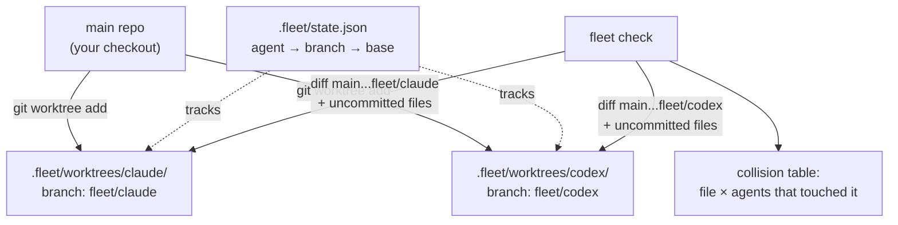

# Architecture

## The model: one worktree per agent

```
your-project/                        <- main repo, your own checkout (e.g. main)
├── .git/
│   └── info/exclude                 <- fleet adds ".fleet/" here on first spawn
├── .fleet/                          <- never committed, lives only on disk
│   ├── state.json                   <- coordination layer (source of truth)
│   └── worktrees/
│       ├── claude/                  <- full checkout of branch fleet/claude
│       └── codex/                   <- full checkout of branch fleet/codex
└── src/ ...                         <- your files, untouched by any agent
```



`fleet spawn <name>` runs `git worktree add .fleet/worktrees/<name> -b fleet/<name> <base>`, records the mapping in `state.json`, then provisions the worktree (`copyOnSpawn` files first, `postSpawn` hook second, so the hook can rely on the copied files). `fleet check` walks every recorded agent, collects the files each one changed (`git diff --name-only <base>...<branch>` for committed work, `git status --porcelain` in the worktree for uncommitted work), and reports any file that appears under more than one agent. `fleet merge` runs that same check first, refuses while the target agent collides with another active agent, runs the `preMerge` hook, merges into the main worktree's current branch, and aborts cleanly (`git merge --abort`) on conflict — the repo is never left mid-merge. `fleet sync` is the same abort-on-conflict merge in the other direction: base into agent branch, run inside the agent's worktree.

`fleet exec <agent> -- <cmd>` re-joins the argv into one shell command (`src/lib/proc.ts` `shellJoin`, a pragmatic quoting heuristic for sh and cmd.exe) and runs it with the worktree as cwd; `--all` fans out sequentially so output never interleaves. `fleet pr` never bundles GitHub logic: it verifies the `gh` binary exists (before pushing anything), pushes the branch to `origin`, and shells out to `gh pr create`.

### Line-level checking (`fleet check --lines`)

File-level overlap stays the default signal, but `--lines` refines it: for each agent, one `git diff -U0 <merge-base>` inside the worktree yields the edited line ranges of committed *and* uncommitted work at once, in old-side (merge-base) coordinates — the only coordinate system two agents' diffs share. Ranges are intersected per file across agents; files whose edits are disjoint are reported informationally instead of counting as collisions (and don't affect the exit code). Untracked and binary files have no line info and stay whole-file collisions. Caveat: when two agents were spawned from different bases their merge bases differ, so cross-agent line numbers are a heuristic, not a guarantee — which is why `--lines` is opt-in.

`list`, `status`, `check`, and `doctor` accept `--json` and print their result object verbatim — the same data the human output renders, for scripts, CI gates, and the agents themselves.

Switchyard needs git >= 2.31 (`rev-parse --path-format=absolute`, used to resolve the main repo root from inside any worktree); `fleet doctor` verifies this.

## Why worktrees, not just branches

Branches alone don't isolate anything — they share one working directory and one index. The incident that motivated this project was exactly that failure mode: two agents on one checkout, one ran `git reset` mid-merge while the other was editing the same files, and the merge state silently vanished.

Worktrees give each agent a **real, separate directory on disk** with its own checked-out files, its own index, and its own HEAD. A `git reset`, `git checkout`, or half-finished merge inside `.fleet/worktrees/codex/` physically cannot disturb the files in `.fleet/worktrees/claude/` or in your main checkout. The only shared surface is the object database and refs — which is precisely what makes `fleet check` cheap: all branches are visible from the main repo without fetching or copying anything.

Switchyard also writes `.fleet/` into `.git/info/exclude` (not `.gitignore`) on first spawn, so it never needs to modify — or dirty — the repository it manages.

## State file schema

`.fleet/state.json` is the source of truth for every command:

```json
{
  "version": 1,
  "agents": {
    "claude": {
      "name": "claude",
      "branch": "fleet/claude",
      "baseBranch": "main",
      "worktreePath": ".fleet/worktrees/claude",
      "createdAt": "2026-07-16T09:30:00.000Z"
    }
  }
}
```

- `version` — schema version, bump on breaking changes to this file.
- `branch` — always `fleet/<name>`; the prefix is what makes `fleet clean` safe to scope.
- `baseBranch` — the branch the agent was spawned from; the default base for `fleet diff`, the merge target checked by `fleet clean`, and the comparison point for ahead/behind counts.
- `worktreePath` — relative to the repo root, forward slashes, so the state file survives the repo being moved or shared across OSes.

Writes go through a write-then-rename (`state.json.tmp` → `state.json`) in `src/lib/state.ts`, so a crash mid-write can't corrupt the file. Commands tolerate drift between state and reality (a manually deleted worktree shows as `worktree missing` in `fleet list`; a manually deleted branch becomes a `fleet clean` candidate) rather than crashing — and `fleet doctor --fix` actively repairs drift: it rebuilds a corrupted `state.json` from real `git worktree list` output, adopts orphaned worktrees back into state, removes leftover non-worktree directories under `.fleet/worktrees/`, and prunes entries whose worktree is gone (branches are never deleted by doctor). Rebuilt entries carry re-derived `baseBranch`/`createdAt` values, not the originals.

## Config file

An optional `.fleetrc.json` at the repo root (committed or not — the user's choice) provides per-repo defaults, read by `src/lib/config.ts`:

```json
{
  "defaultBase": "main",
  "watchInterval": 3,
  "autoClean": false,
  "copyOnSpawn": [".env"],
  "postSpawn": "npm ci",
  "preMerge": "npm test"
}
```

| Key | Type | Used by | Built-in default |
| --- | --- | --- | --- |
| `defaultBase` | string | `fleet spawn` base when `--from` is absent | current branch |
| `watchInterval` | number (seconds) | `fleet watch` refresh rate | 3 |
| `autoClean` | boolean | run a `fleet clean` sweep after each successful `fleet merge` | false |
| `copyOnSpawn` | string[] (repo-root-relative) | `fleet spawn` copies these into every new worktree (gitignored essentials: `.env`, local config). Absolute paths and `..` segments are rejected at parse time | none |
| `postSpawn` | string (shell command) | `fleet spawn` runs it inside the new worktree after copying. Failure is reported, worktree kept | none |
| `preMerge` | string (shell command) | `fleet merge` runs it inside the agent's worktree after the collision gate; non-zero exit aborts before the merge starts | none |

Precedence is always CLI flag > `.fleetrc.json` > built-in default. Unknown keys and wrong types are hard errors (typo protection), a missing file is not. Note the distinction around merge cleanup: removing the merged agent itself is `fleet merge`'s default behavior (opt out per-invocation with `--no-clean`); `autoClean` only controls the *additional* sweep of other fully merged agents.

## Current limitations

- **Single-repo scope.** State lives per-repository; there is no cross-repo view of agents.
- **No submodule support.** Worktrees of repos with submodules are untested and likely broken; don't rely on them.
- **No remote/multi-machine coordination.** `state.json` is local disk only — two machines managing the same clone don't see each other's agents. Nothing syncs, nothing locks.
- **Collision detection is file-level by default.** Two agents editing disjoint parts of one file is still flagged — deliberately, since file-level overlap is where merge pain starts. `fleet check --lines` opts into line-range intersection, with the merge-base caveat described above.
- **`clean --stale` judges idleness by the branch's last commit date.** Uncommitted-but-untouched-for-weeks worktrees are protected by the dirty check instead (never removed), since file mtimes are too easy to disturb to trust for deletion.
